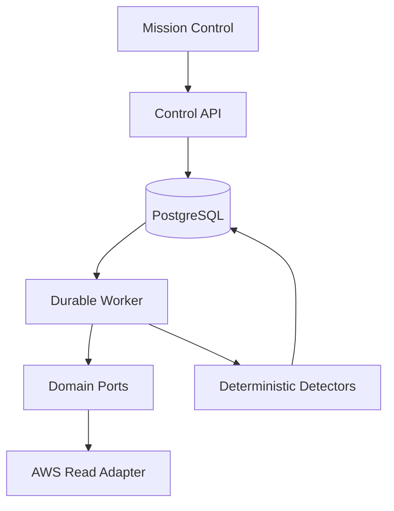
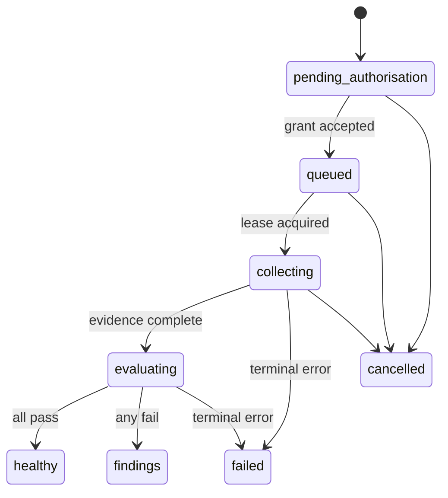
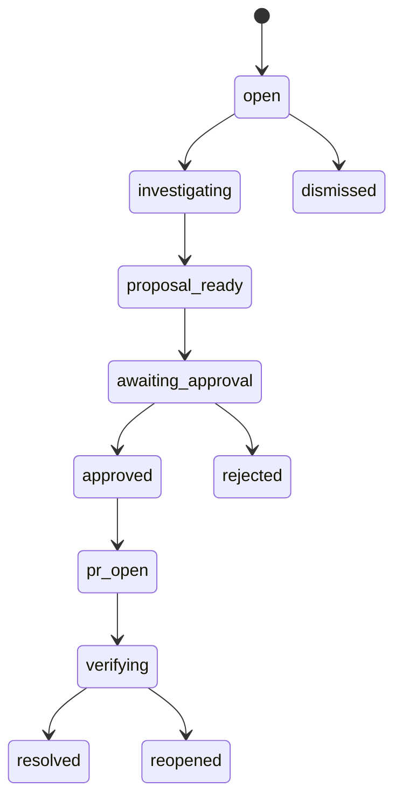

# Grounds — Build-Ready Plan

Status: **ready for Build 0 and Build 1**  
Builder: **Grok 4.6 High in Cursor**  
Architecture gate: **GPT-5.6 Sol, read-only**  
Independent review: **Claude Opus 5, high effort, read-only**  
Working name: **Grounds**  
Product rule: **No change without grounds.**

> `Grounds` is a working product and repository name, not a trademark or domain clearance.

## 1. Product description

Grounds is an evidence-first platform operations control plane. It gathers time-bounded facts from runtime systems, evaluates them with deterministic policy, opens a governed case when something is wrong, and can eventually prepare an exact, testable infrastructure pull request for a human to approve.

Models can investigate and explain. They cannot manufacture facts, change deterministic severity, approve their own work, mutate production, merge code or deploy.

## 2. Product boundary

Grounds is a standalone product and repository with its own control plane, persistence, state machines and user interface.

Vincula remains a separate typed workflow runtime. Grounds must not depend on Vincula for v0.1. A later integration is allowed only behind Grounds' workflow port and only after the manual vertical slice is proven. Grounds owns its operational domain, evidence semantics, policy, authorisation and external-action reconciliation regardless of execution runtime.

### In scope for v0.1

- One organisation.
- Two allowlisted AWS accounts: one non-production target and one audit/control account.
- One AWS region per assurance profile.
- ECS services behind an Application Load Balancer.
- Manual, explicitly authorised runs.
- Direct AWS evidence collection through least-privilege, short-lived STS credentials.
- Deterministic health and observability detectors.
- A small Mission Control UI showing runs, findings and cited evidence.
- Durable PostgreSQL orchestration with retry, fencing and deterministic replay.
- Local and CI execution.

### Explicitly out of scope for the authorised build

- Scheduled or autonomous runs.
- Any state-changing AWS API.
- Shell or AWS CLI access exposed to a model.
- Terraform edits, pull requests, merge or deployment.
- Kubernetes, Lambda, RDS or multi-cloud collectors.
- Self-modifying prompts, policies or detectors.
- Automatic learning from an incident.
- A general-purpose agent framework.
- A dependency on AWS DevOps Agent.
- Public or production deployment before real OIDC/RBAC exists.

## 3. Why this is a platform rather than a demo

The reference project is a useful demonstration of Kiro Crew delegating AWS service investigations, but its repository is mainly configuration, broad recurring prompts, string-based deny patterns and a connection test that does not make a remote call. Grounds takes the opposite position: the control plane and its invariants are the product.

| Concern | Reference approach | Grounds decision |
| --- | --- | --- |
| Work selection | A recurring prompt invokes service-shaped agents | An authorised profile creates a durable, scoped run |
| Facts | Agent/tool output is investigation context | Normalised, immutable observations with source and time window |
| Decisions | Prompt-led recommendations | Registered deterministic detectors return PASS, FAIL or UNKNOWN |
| Security | Broad read policy plus command deny strings | Least-privilege role, app allowlist and no mutator capability in the binary |
| Recovery | Process-level execution | Leases, heartbeats, fencing, idempotency and replay |
| Change control | Mixed PR-only and direct-remediation claims | No cloud mutation; later changes are isolated diffs bound to exact approval |
| External writes | Tool call | Transactional outbox plus reconciliation |
| Learning | Free-form retained lessons | Human-approved, versioned and expiring knowledge only |
| Verification | Happy-path script output | Unit, integration, contract, failure-injection and end-to-end tests |
| Provider coupling | AWS-shaped agent topology | Provider-neutral domain ports with an AWS adapter |

## 4. Product principles

1. **Evidence before inference.** Direct collectors establish facts. Models only reason over cited facts.
2. **Unknown is a result.** Missing, stale, contradictory or inaccessible evidence produces `UNKNOWN`, never `HEALTHY`.
3. **Least capability, not prompt prohibition.** Dangerous tools do not exist in the execution surface.
4. **Authorisation is an object.** Approval is cryptographically bound to the scope and exact payload it authorises.
5. **Every side effect is reconcilable.** Durable intent precedes external action.
6. **One writer.** Grok owns implementation. Specialist agents inspect and report only.
7. **Narrow vertical slices.** Prove one ECS scenario end to end before adding providers or autonomous operation.

## 5. v0.1 architecture



Only the worker receives AWS credentials. The API and browser never receive them. The detector package imports domain types, not AWS SDK types. Build 1 contains no model provider and no MCP client.

### Local deployment shape

- `web`: Next.js Mission Control.
- `api`: Fastify HTTP API.
- `worker`: Node.js process claiming PostgreSQL jobs.
- `postgres`: source of truth.
- `otel-collector`: optional local telemetry sink.

Use Docker Compose for dependencies, but support running the three Node processes directly. Bind the API to loopback by default. A non-development start must fail until an authenticated identity provider is configured.

## 6. Repository layout

```text
grounds/
├── AGENTS.md
├── .cursor/agents/
│   ├── architecture-reasoning.md
│   └── independent-reviewer.md
├── apps/
│   ├── api/
│   ├── web/
│   └── worker/
├── packages/
│   ├── domain/
│   ├── application/
│   ├── persistence-postgres/
│   ├── adapter-aws/
│   ├── detectors-ecs/
│   ├── observability/
│   └── test-support/
├── migrations/
├── docs/
│   ├── architecture/
│   ├── decisions/
│   ├── runbooks/
│   └── threat-model.md
├── fixtures/aws/ecs/
├── compose.yaml
├── package.json
├── pnpm-workspace.yaml
├── tsconfig.base.json
└── BUILD_READY_PLAN.md
```

### Technical choices

- Node.js 24, pinned.
- TypeScript with every strictness option enabled; no unchecked `any`.
- pnpm workspaces. Do not add Turborepo until task volume justifies it.
- Fastify and JSON Schema at the HTTP boundary.
- PostgreSQL and explicit SQL migrations.
- `pg` with a thin repository layer; domain objects do not depend on an ORM.
- Zod only at configuration and external-data boundaries.
- AWS SDK for JavaScript v3.
- Vitest, Testcontainers and Playwright.
- OpenTelemetry traces, metrics and structured logs.
- SHA-256 over canonical JSON for content identities.

Pin every dependency in the lockfile. Do not use `@latest` in executable configuration.

## 7. Core domain contracts

These are conceptual TypeScript contracts. The builder may improve names while preserving semantics.

```ts
type Provider = "aws";
type AssuranceResult = "PASS" | "FAIL" | "UNKNOWN";

interface ResourceRef {
  provider: Provider;
  accountId: string;
  region: string;
  service: "ecs";
  resourceType: "service";
  resourceId: string;
}

interface EvidenceWindow {
  from: string;
  to: string;
}

interface Observation<T> {
  id: string;
  schemaVersion: 1;
  resource: ResourceRef;
  kind: string;
  collectedAt: string;
  window: EvidenceWindow;
  source: {
    adapter: string;
    operation: string;
    requestDigest: string;
  };
  freshness: "FRESH" | "STALE";
  payload: T;
  payloadDigest: string;
  redactionVersion: string;
}

interface Finding {
  id: string;
  detectorId: string;
  detectorVersion: string;
  profileVersionId: string;
  resource: ResourceRef;
  result: AssuranceResult;
  severity: "INFO" | "LOW" | "MEDIUM" | "HIGH" | "CRITICAL";
  title: string;
  explanation: string;
  observationIds: string[];
  fingerprint: string;
  evaluatedAt: string;
}

interface ChangeAuthorisation {
  id: string;
  actorId: string;
  profileVersionId: string;
  resourceScopeDigest: string;
  baseSha: string;
  diffDigest: string;
  outboundPayloadDigest: string;
  grantedAt: string;
  expiresAt: string;
}
```

### Required ports

- `ResourceInventoryPort`
- `TelemetryPort`
- `ChangeHistoryPort`
- `RepositoryMappingPort`
- `InvestigationSpecialistPort`
- `ScmPort`
- `IsolationPort`
- `CheckRunner`
- `EvidenceStore`
- `ExternalActionOutbox`
- `IdentityProvider`

Only `ResourceInventoryPort` and `TelemetryPort` receive real implementations in Build 1. Other ports can exist as interfaces or ADRs without speculative framework code.

## 8. Durable state model

### Assurance run



### Assurance case, reserved for later milestones



### Persistence tables required in Build 0

| Table | Required purpose |
| --- | --- |
| `profile_versions` | Immutable run configuration and allowlisted scope |
| `authorisation_grants` | Actor, permitted action, scope digest and expiry |
| `assurance_runs` | Current state, pinned inputs, idempotency key and timestamps |
| `run_steps` | Attempt, lease owner, lease expiry, `lease_epoch`, state and error |
| `observations` | Immutable normalised evidence plus digests |
| `findings` | Detector output and cited observations |
| `cases` | Deduplicated issue lifecycle; schema present, workflow deferred |
| `events` | Append-only state and audit events with per-aggregate sequence |
| `outbox` | Durable external intent; schema and fake reconciler in Build 0 |

Database constraints must enforce uniqueness for run idempotency, observation content identity, finding fingerprint and outbox idempotency.

### Concurrency rules

- Claim work with `FOR UPDATE SKIP LOCKED`.
- Increment `lease_epoch` whenever a lease is acquired or recovered.
- Every step commit includes the expected `lease_epoch` and expected state.
- A worker that loses its lease cannot commit results.
- Heartbeats extend leases only for the current owner and epoch.
- Retry uses the same step identity and creates a new attempt record/event.
- Cancellation is persisted, checked between bounded operations, and terminal for the current run.
- Run idempotency key is a digest of organisation, profile version, resource scope, evidence window and trigger identity.

## 9. Evidence contract

An observation is acceptable only when it is:

- from an approved adapter operation;
- inside the authorised account, region, service and resource scope;
- time-bounded;
- schema-valid;
- redacted before persistence;
- content-addressed;
- immutable after insertion; and
- fresh enough for its detector.

Store normalised payloads, not arbitrary terminal output. Cap each persisted payload at 1 MiB in v0.1. Truncate and mark oversize input explicitly. Never persist credentials, request signatures, environment variables or unredacted log lines.

Every finding must cite at least one observation. `PASS` also needs evidence. If a required source fails, is stale or contradicts another required source, the detector returns `UNKNOWN` and records the reason.

## 10. AWS adapter and permissions

The target account exposes a dedicated role assumed with a short session and an external ID. Do not attach AWS managed `ReadOnlyAccess`.

Build 1 requires an allowlist drawn only from:

- `ecs:DescribeServices`
- `ecs:ListTasks`
- `ecs:DescribeTasks`
- `elasticloadbalancing:DescribeTargetGroups`
- `elasticloadbalancing:DescribeTargetHealth`
- `cloudwatch:DescribeAlarms`
- `cloudwatch:GetMetricData`
- `sts:GetCallerIdentity`

If resource-level IAM constraints are unavailable for an operation, constrain by account/region role, explicit application scope, request validation and post-response resource matching. A response containing an out-of-scope resource is rejected rather than filtered silently.

The adapter must not import state-changing AWS commands. Add an architecture test that rejects imports matching create, put, update, delete, register, deregister, run, start, stop, terminate, modify, set or tag command families within `adapter-aws`.

## 11. First vertical scenario

An ECS service repeatedly replaces unhealthy tasks because its load balancer health check receives an unacceptable response on the configured health path. The service also lacks an effective owner-notifying alarm for unhealthy targets or a persistent running-task deficit.

Grounds must:

1. Accept a manual authorisation for one exact ECS service and evidence window.
2. Collect service, task, target-group, target-health, alarm and metric observations.
3. Persist each observation once with source, freshness and digest.
4. Evaluate both detectors below.
5. Show FAIL or UNKNOWN with direct evidence citations.
6. Survive worker death after collection without duplicating findings.
7. Reject a request for another service, account or region.
8. Make no state-changing AWS call.

### `GRD-ECS-001` — Repeated unhealthy replacement

Return `FAIL` when all of the following are evidenced in the profile window:

- the ECS service is attached to the inspected target group;
- target health reports a load-balancer health-check failure;
- service/task evidence shows repeated task replacement or sustained desired/running deficit; and
- the affected target group's configured health-check path and matcher are captured.

The finding may say the health-check contract is failing. It must not claim a missing application route unless later repository evidence proves that claim.

Return `UNKNOWN` when any required evidence is absent, stale, inaccessible or internally contradictory.

### `GRD-OBS-001` — Missing effective owner notification

Return `FAIL` when no enabled CloudWatch alarm in scope covers either unhealthy target count or sustained desired/running task deficit with at least one configured notification action.

Do not accept CPU utilisation alone as coverage for task health. Return `UNKNOWN` if alarm inventory cannot be read completely.

## 12. HTTP API for Build 1

All write endpoints require an idempotency key and an authenticated actor supplied by the development-only identity port.

| Method | Path | Behaviour |
| --- | --- | --- |
| `POST` | `/v1/authorisations` | Create a short-lived manual run grant for one profile and scope |
| `POST` | `/v1/runs` | Validate grant and enqueue an idempotent run |
| `GET` | `/v1/runs` | List runs with state and result summary |
| `GET` | `/v1/runs/:id` | Return pinned inputs, steps, findings and evidence links |
| `POST` | `/v1/runs/:id/cancel` | Persist cancellation request |
| `GET` | `/health/live` | Process liveness only |
| `GET` | `/health/ready` | Database and migration readiness |

Return RFC 9457 problem details. Never include stack traces, AWS request objects or secrets in API errors.

## 13. Mission Control UI

Build only three screens:

1. **New run** — choose an allowlisted profile, show exact account/region/service/window, create the grant and run.
2. **Run list** — state, result, service, evidence window, created time and duration.
3. **Run detail** — timeline, collector status, PASS/FAIL/UNKNOWN findings and expandable cited observations.

Make UNKNOWN visually distinct from PASS and FAIL. Do not use a single green/red score. The UI must show the pinned profile version and evidence collection time.

## 14. Security and trust boundaries

- Treat AWS responses, tags, names and log-like strings as untrusted data.
- Never concatenate evidence into executable shell, SQL or policy expressions.
- No model is present in Builds 0–1.
- Credentials are worker-memory-only and expire quickly.
- Redact secrets before logging and persistence.
- Deny cross-scope requests before any provider call.
- Record actor, grant, scope, adapter operation and result digest in the event stream.
- Run dependency, secret and licence scans in CI.
- Produce an SBOM for release artefacts.
- No public deployment until OIDC, RBAC, CSRF protection and an external penetration review are complete.

## 15. Observability

Every log event includes `traceId`, `runId`, `stepId`, `attempt`, `leaseEpoch`, `profileVersionId` and `resourceFingerprint` when applicable.

Required metrics:

- run count and duration by terminal state;
- step attempts, retries and lease recoveries;
- collector latency and provider errors by operation;
- PASS/FAIL/UNKNOWN detector totals;
- evidence age and rejected out-of-scope response count;
- duplicate insert conflicts; and
- outbox lag, even though Build 1 has no real external write.

## 16. Test strategy

### Unit

- Canonical JSON and stable digests.
- Resource-scope validation.
- Every allowed and forbidden state transition.
- Detector PASS, FAIL and UNKNOWN truth tables.
- Evidence freshness and contradiction handling.
- Redaction and payload caps.
- Finding fingerprint stability.

### PostgreSQL integration

- Two workers race; one claims a step.
- Expired lease is recovered with a higher epoch.
- Stale worker cannot commit.
- Crash after observation insert and before step completion is safely replayed.
- Same request creates one run.
- Same evidence creates one observation.
- Same detector result creates one finding.
- Event sequence cannot fork.

### AWS adapter contract

- Healthy fixture.
- Repeated unhealthy replacement fixture.
- Missing alarm fixture.
- Partial API failure fixture.
- Stale metric fixture.
- Cross-account/region/resource response fixture.
- Pagination fixture.
- Throttling and retry fixture.
- No state-changing command import.

### End to end

- Authorise and run a healthy service: terminal `healthy` with cited PASS findings.
- Authorise and run the failure fixture: terminal `findings` with both detector failures.
- Kill the worker mid-run, restart it, and receive one terminal run with no duplicates.
- Cancel during collection and prove no later step commits.
- Request an unapproved service and prove zero AWS calls occurred.
- Fail one required collector and show UNKNOWN, never healthy.

## 17. Build sequence

### Build 0 — trustworthy skeleton

Deliver:

- root `AGENTS.md` containing the repository-wide operating contract;
- monorepo and strict compiler/lint/test configuration;
- domain value objects and state machines;
- SQL schema and migrations;
- durable PostgreSQL queue, lease, heartbeat and fencing logic;
- append-only events and transactional outbox skeleton;
- fake provider adapters;
- API liveness/readiness;
- concurrency, idempotency and recovery integration tests;
- ADRs for evidence, orchestration, security and provider boundaries;
- threat model; and
- CI.

Exit gate:

- all tests pass from a clean clone;
- a forced worker crash is recovered without duplicate state;
- architecture-reasoning reports no blocking invariant violation.

### Build 1 — manual deterministic ECS assurance

Deliver:

- immutable assurance profile versions;
- development-only manual identity and short-lived grants;
- scoped AWS assume-role adapter;
- ECS, target health, metrics and alarm collectors;
- `GRD-ECS-001` and `GRD-OBS-001`;
- the three UI screens;
- evidence citations and run timeline;
- fixtures and the full Build 1 test matrix;
- local operator runbook; and
- a demonstration script using fixtures, plus an optional real read-only AWS smoke test.

Exit gate:

- every Build 1 acceptance test passes;
- no state-changing AWS command exists in the dependency graph;
- Opus reviewer returns `PASS` with no Critical or High findings;
- build evidence records exact commands, exit codes and relevant artefact digests.

### Build 2 — investigation assistance, not yet authorised

- Parallel direct collectors and change history.
- Optional AWS DevOps Agent connection through `InvestigationSpecialistPort`.
- Advisory hypotheses with mandatory observation citations.
- Explicit degraded mode when the remote agent is unavailable.
- Recovery, timeout and budget enforcement.

### Build 3 — isolated proposal, not yet authorised

- Repository mapping.
- Isolated Git worktree/container.
- Terraform-only proposal for the proven ECS scenario.
- Policy, format, validate, unit and plan checks.
- Reject grace-period-only or timeout-only patches when the health contract remains broken.
- Exact authorisation binding to profile, base SHA, diff and outbound payload.

### Build 4 — reconciled draft pull request, not yet authorised

- GitHub App.
- Transactional outbox and reconciliation.
- At most one draft PR per proposal.
- No merge, deploy or cloud mutation.

### Build 5 — scale and scheduling, not yet authorised

- Schedule grants, multi-account inventory, budgets and deduplication.
- Production OIDC/RBAC and tenant isolation.
- Rate limits and operational SLOs.

### Build 6 — closed-loop verification, not yet authorised

- Post-merge/deployment observation.
- Resolution or reopen based on fresh deterministic evidence.
- Human-approved, versioned and expiring lessons.

## 18. Binding invariants

These are release blockers, not guidance.

1. Every run pins profile version, scope, evidence window and detector versions.
2. Observations are immutable, time-bounded and content-addressed.
3. Findings come only from registered deterministic detectors and cite observations.
4. A model cannot invent findings, alter deterministic severity or authorise action.
5. Missing or stale required evidence yields UNKNOWN, never PASS.
6. Replay of the same observations and detector versions yields the same fingerprints.
7. AWS SDK types do not cross the adapter boundary.
8. An investigation specialist is advisory and never the sole basis for a proposal.
9. Provider data, MCP output and repository text are untrusted data.
10. Credentials never enter prompts, observations, events or browser responses.
11. Provider reads are constrained by grant, account, region, service, resource, action and time.
12. A model never receives raw shell or AWS CLI access.
13. Future remediation runs only in an isolated worktree and container.
14. v0.1 cannot mutate AWS, merge or deploy.
15. Future approval binds profile, scope, base SHA, diff and outbound payload digests.
16. Any changed bound value invalidates approval.
17. Future GitHub writes use a transactional outbox and reconciliation.
18. One proposal creates at most one draft pull request.
19. Lease fencing protects every durable step commit.
20. Repeated finding fingerprints deduplicate into one case.
21. Learned knowledge requires human approval, versioning, provenance and expiry.
22. Every run records cost, duration, provenance and evidence.

## 19. Definition of done for the authorised build

Builds 0 and 1 are done only when:

- the repository builds and tests from a clean clone with one documented command;
- database migrations work both up and down in a disposable database;
- a real PostgreSQL concurrency test proves lease fencing;
- detector outcomes are reproducible from checked-in fixtures;
- all findings and passes cite immutable observations;
- partial failure produces UNKNOWN;
- scope violations cause no AWS request;
- no AWS mutator command is present;
- the UI exposes state and evidence without hiding uncertainty;
- the threat model and operator runbook match the implementation;
- the architecture subagent has approved the design before code;
- the Opus subagent has independently inspected code and run tests after code;
- every Opus Critical/High issue is fixed and re-reviewed; and
- the builder reports remaining Medium/Low issues without relabelling them as complete.

## 20. Cursor operating model

Use one writable builder and two read-only specialists:

| Role | Cursor model | Writes | Invocation |
| --- | --- | --- | --- |
| Builder | Grok 4.6 High | Yes | Main Cursor agent |
| Architecture gate | `gpt-5.6-sol` | No | Before each milestone |
| Independent reviewer | `claude-opus-5[effort=high]` | No | After implementation and fixes |

Cursor already provides Explore, Bash and Browser subagents. Do not duplicate them. Do not create service-shaped ECS, CloudWatch, Terraform or Kubernetes agents. Add a specialist only when it has a distinct trust boundary or context-isolation need.

Project subagents live in `.cursor/agents/`; they are files in the repository, not separate projects or permanent chat threads. If a mobile UI exposes only one creation flow, create the two files sequentially or ask the main agent to add both files. Verify the actual model shown for each run because Cursor can fall back when a plan or team policy disallows the configured model.

The root `AGENTS.md` is a separate concern. It is the always-on repository operating contract for the main agent and every relevant session. It defines scope, invariants, working method and verification commands. The files under `.cursor/agents/` define callable specialist roles with isolated context. Grounds requires both.

## 21. Source references

- Reference article: https://dev.to/aws-builders/i-built-an-aws-devops-ai-agent-using-kiro-crew-mcp-fk0
- Reference repository: https://github.com/SimplyNadaf/kiro-crew-devops-agent
- Kiro Crew repository: https://github.com/kirodotdev/KiroCrew
- Cursor subagents: https://cursor.com/docs/subagents
- Cursor rules and `AGENTS.md`: https://cursor.com/docs/rules
- AWS DevOps Agent overview: https://docs.aws.amazon.com/devopsagent/latest/userguide/about-aws-devops-agent.html
- AWS DevOps Agent remote MCP/A2A access: https://docs.aws.amazon.com/devopsagent/latest/userguide/accessing-devops-agent-connect-to-devops-agent-remote-servers.html
- AWS DevOps Agent security: https://docs.aws.amazon.com/devopsagent/latest/userguide/aws-devops-agent-security.html
- Limiting AWS DevOps Agent access: https://docs.aws.amazon.com/devopsagent/latest/userguide/aws-devops-agent-security-limiting-agent-access-in-an-aws-account.html
- CloudWatch recommended alarms: https://docs.aws.amazon.com/AmazonCloudWatch/latest/monitoring/Best_Practice_Recommended_Alarms_AWS_Services.html
