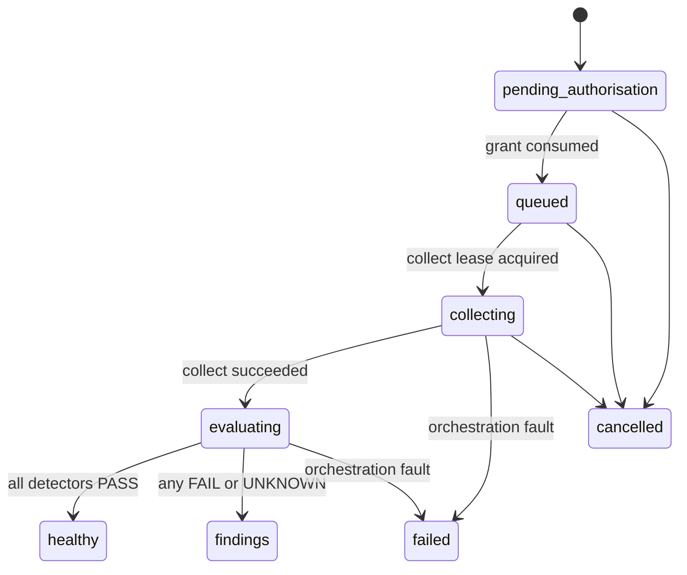
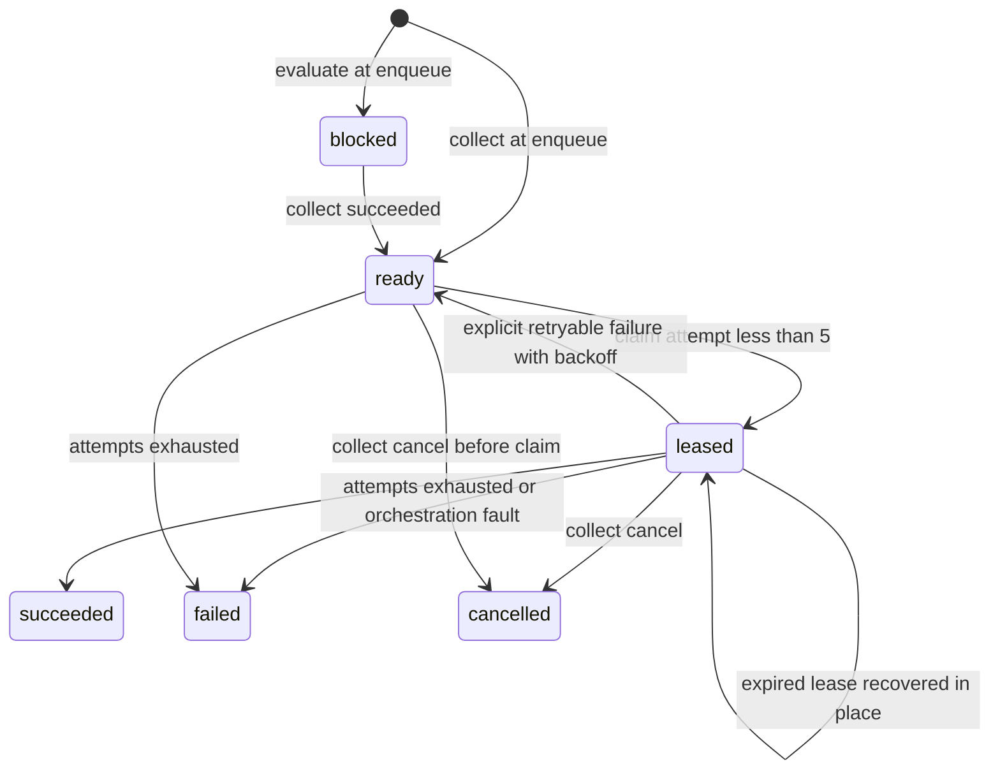

# State machines

## Assurance run

`healthy` requires every pinned detector to return PASS. Any UNKNOWN terminates as `findings`. Evaluating is not cancellable. A cancel requested during evaluate is recorded and ignored for that in-flight lease.

`failed` is an internal orchestration fault, not a missing collector.

## Steps

`evaluate` is created `blocked` and cannot be claimed until `collect` is `succeeded`. Expired lease recovery stays on `leased` with a higher `lease_epoch` and incremented `attempt`. `ready` is used for the first claim and for explicit retryable failure after `next_attempt_at`.
